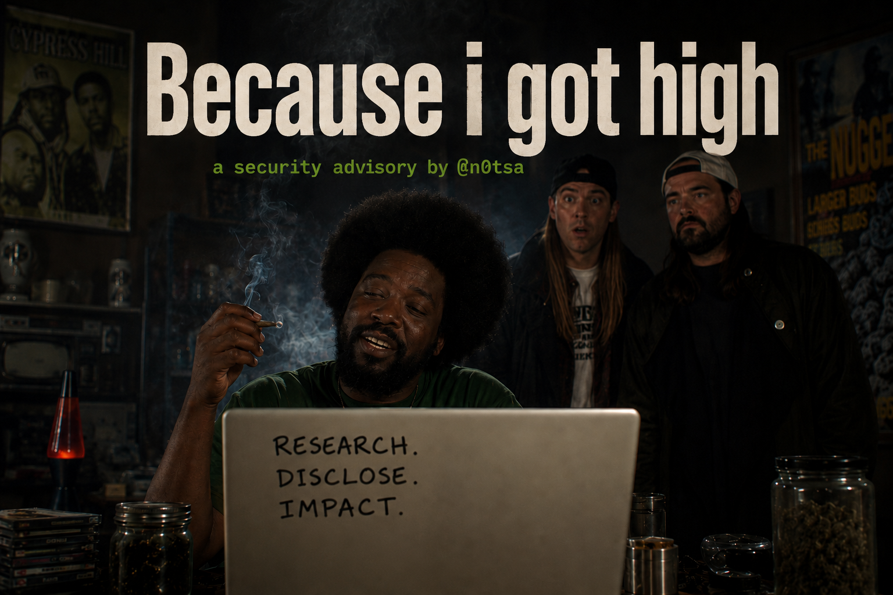
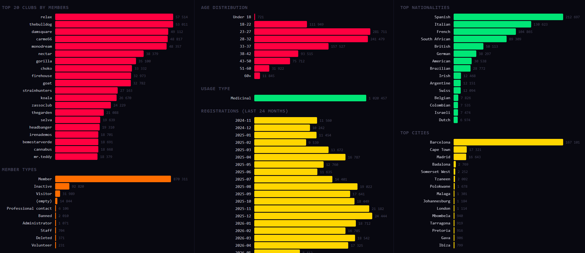

# Because I Got High



## How a cannabis club management platform left 1,082,680 medical records, 985,841 passport scans (including mine), and the private messages of every member it ever served on a server with no authentication

**Report Date:** June 10, 2026  
**Researcher:** Sammy Azdoufal  
**Research Type:** Independent. I am a dues-paying member of a cannabis social club in Barcelona. I am one of the 1,082,680 records in the database described in this report. I downloaded the optional app my club offered, decompiled it, and found this. Most of the other 1,082,679 people in that database never downloaded anything at all.

---

## Before We Get to the Technical Part

Every cannabis social club asks for the same things when you join. Your full legal name. Your home address. Your phone number. Your email. Your date of birth. Your nationality. A scan of your passport or national ID card. You hand these over because the model requires it whether you're in Barcelona, Cape Town, London, or Johannesburg. The CSC model only works if membership is documented, verified, and controlled. The clubs exist in a regulated grey zone and they know it their legal defensibility depends entirely on knowing exactly who their members are.

The platform also records something else. In the member profile database, every single one of the 1,082,680 members carries an identical field:

```
usage_type: Medicinal
```

**1,020,457 members** 94% of the total are classified by the software as **medicinal cannabis users**. Whether they used the PuffPal app or not. Whether they had ever heard of PuffPal or not.

Under GDPR Article 9, health data is the most protected category of personal information. It cannot be processed without explicit consent and adequate safeguards. A breach of health data triggers the highest tier of regulatory penalties up to **€20 million or 4% of global annual turnover**. The standard notification obligations under Article 33 apply within 72 hours of discovery.

The irony is architectural. The clubs collect all this information, apply a medical classification to every member, store that classification alongside passport scans and home addresses and then left all of it accessible via an unauthenticated HTTP endpoint that accepted any integer from 1 to however many members the club had.

The physical bouncer at the door checks your member card. The digital one wasn't there.

---

## The Numbers

| Category | Count |
|---|---|
| Total member profiles (health records) | **1,082,680** |
| With passport or national ID number | **923,543** |
| With monthly consumption amount recorded | **1,077,294** |
| With strain preferences on file | **434,000+** |
| With phone number | **405,857** |
| With home address | **196,132** |
| ID document photos on public server | **985,841** |
| Firebase accounts (+ FCM push tokens) | **25,425** |
| Private messages accessible cross-account | **9,030** |
| Countries in the database | **40+** |

---

## Table of Contents

1. [How This Started](#how-this-started)
2. [What Is CCS Nube?](#what-is-ccs-nube)
3. [F-01 The Membership Register Had No Lock](#f-01--the-membership-register-had-no-lock)
4. [F-02 985,841 Passport Scans on a Public URL](#f-02--985841-passport-scans-on-a-public-url)
5. [F-03 The Stripe Secret Key Was in the App](#f-03--the-stripe-secret-key-was-in-the-app)
6. [F-04 Firebase: 25,425 Accounts and Every Push Token](#f-04--firebase-25425-accounts-and-every-push-token)
7. [Other Findings](#other-findings)
9. [The Geography Problem](#the-geography-problem)
10. [The Medical Classification](#the-medical-classification)
11. [What Happens Now](#what-happens-now)
12. [Disclosure Timeline](#disclosure-timeline)
13. [If You Are a Club Member](#if-you-are-a-club-member)

---

## How This Started

In April 2026 I joined a cannabis social club in Barcelona. The process took about forty minutes. I filled in a form with my name, address, phone, and email. I showed my passport. A staff member photographed it. I signed the club statutes. They handed me a member card and mentioned, almost as an afterthought, that there was an app I could download if I wanted PuffPal. Optional. For check-ins and ordering.

My passport scan and home address were in their backend regardless. The app was just a convenience layer on top of the same database that every other member was already in including the ones who had never heard of PuffPal, the ones who registered at the front desk a year ago and went home without installing anything.

I downloaded it anyway. Then I decompiled it.

Line 4 of `com/nefos/ccsmembersapp/Util/Utils.java`:

```java
public static final String SECRET_KEY = "[REDACTED]";
```

That's a Stripe secret key. It was hardcoded in the app. Anyone who decompiled it had it. It took twenty minutes. The app was my entry point but the damage I found wasn't in the app. It was in the server that every member, app or no app, was already exposed to.

Two hours later I had confirmed an unauthenticated IDOR on the member profile API. The `user_id` parameter was a sequential integer. There was no authentication token, no session cookie, no API key. I sent the request with my own user ID, then with a neighboring integer. Both returned full member profiles. I wrote a loop.

I ran it overnight. By the following morning I had 1,082,680 records.

---

## What Is CCS Nube?

CCS Nube (`ccsnubev2.com`) is a SaaS backend platform built by Nefos for cannabis social club management. It is the infrastructure: the database, the API, the admin portal, the identity verification workflow, the payment processing, the messaging layer. PuffPal (`com.nefos.ccsmembersapp`) is one of the interfaces on top of it a white-label Android app that some clubs offer to their members for check-ins, ordering, and messaging.

The key word is *offer*. PuffPal is optional. Many clubs enroll members entirely through the web portal, a physical POS terminal at the front desk (`pos-register.php`), or through club staff directly. A member can be registered, identity-verified, photographed, and assigned a membership number without ever knowing that PuffPal exists. Their record lands in the same database. Their passport scan goes into the same folder. The same unauthenticated endpoint returns their profile.

The app was my entry point into the research. It was not the source of the vulnerability. The vulnerability was the backend. The 1,082,680 victims are the members of clubs that used CCS Nube not the users of an app.

At the time of this audit the platform served **377 clubs across multiple countries** and **1,082,680 registered members**. The majority of clubs are in Spain, but the platform is not a Spanish product. It operates clubs in South Africa Cape Town alone accounts for 17,321 members, the second-largest city on the platform after Barcelona. Clubs in London, Johannesburg, Pretoria, Malaga, Ibiza and others are all on the same backend, the same database, the same unauthenticated endpoint.

The clubs that run on this platform include some of the most well-known names in the global cannabis scene. The Bulldog the Amsterdam brand that turned cannabis culture into global hospitality has a CSC on this platform with **53,011 member records**. Strain Hunters: **27,163**. Sky Lounge: **25,989**. Green Sensation: **24,591**. Twenty clubs had over 18,000 members each.

These are not small operations. They are businesses with payroll, legal counsel, regulatory relationships with city governments, and a fundamental promise to their members: your identity is protected here. The CSC model works because discretion is baked in. Members trust the club with legally sensitive information because the alternative is the black market. That trust was downstream of whatever Nefos put in their server configuration. What Nefos put there was nothing.

---

## F-01 The Membership Register Had No Lock

**Endpoint:** `POST https://ccsnubev2.com/v8/api/userProfile.php`  
**Authentication required:** None  
**CVSS 3.1:** 9.8

```
POST /v8/api/userProfile.php HTTP/1.1
Host: ccsnubev2.com
Content-Type: application/x-www-form-urlencoded

user_id=1&club_name=thebulldog&language=en
```

No `Authorization` header. No session token. No API key. No CAPTCHA. No rate limit.

The `user_id` parameter is a sequential integer starting at 1, scoped per club. The club list is enumerable via the public `clubList.php` endpoint. For each club, iterate `user_id` from 1 to `max_known_uid + 200`. The server returns the following for every valid integer:

```json
{
  "flag": "1",
  "data": {
    "first_name": "…",    "last_name": "…",
    "email": "…",         "dnipassport": "…",
    "telephone": "…",     "street": "…",
    "streetnumber": "…",  "postcode": "…",
    "city": "…",          "country": "…",
    "nationality": "…",   "dob": "…",
    "gender": "…",        "member_type": "…",
    "consumption": "…",   "prefs1": "…",
    "usage_type": "Medicinal",
    "photo": "…",         "qr": "…"
  }
}
```

Notice the last field before `photo`. Every profile returns `usage_type: Medicinal`. That field is not incidental it is recorded, stored, and returned as part of every member record the platform holds. It is a medical classification, attached to a name, a passport number, a home address, and a photograph of a government-issued identity document.

**Extracted across 377 clubs:**

| Field | Records |
|---|---|
| Full member profiles | **1,082,680** |
| Medical classification (`usage_type: Medicinal`) | **1,082,680** |
| Passport or national ID number | **923,543** |
| Monthly consumption amount | **1,077,294** |
| Product strain preferences | **434,000+** |
| Phone number | **405,857** |
| Home address | **196,132** |

The consumption amounts are specific. A member record contains fields like `consumption: 30 g.` their declared monthly cannabis intake alongside their full identity and medical classification. Their product preference history, stored as `prefs1`, names the specific strains they consume with quantities: `AMNESIA HAZE (1g)`, `RAINBOW CHIP (2g)`, `OG KUSH (3g)`.

This is not a generic PII database. It is a detailed medical and consumption profile attached to a real, verified, photographed human identity, with no authentication required to read it.

---

## F-02 985,841 Passport Scans on a Public URL

**Pattern:** `https://ccsnubev2.com/v8/images/_{club}/ID/{user_id}-front.jpg`  
**Authentication required:** None  
**CVSS 3.1:** 9.1

During CSC registration, your identity document is photographed. That photograph of your passport, your national ID card, or your driver's licence is stored on the server that runs the platform. It contains your full legal name, your photograph, your date of birth, your issuing country, your document number, your expiry date.

The file is stored at a predictable path. The club name is from F-01. The user ID is from F-01. There is no access token. There is no signed URL. There is no expiry. There is no authentication of any kind.

```
GET https://ccsnubev2.com/v8/images/_thebulldog/ID/12345-front.jpg
HTTP/1.1 200 OK
Content-Type: image/jpeg
[passport scan]
```

**985,841 members have ID document photographs accessible at this path.** No credentials. No token. HTTP GET.

Think about the design decision that produced this. Someone built the identity verification workflow the part where the club photographs your passport to comply with legal requirements and then stored the resulting images in a static folder served by a web server with no access control. The most sensitive file in the whole system, the one that proves who you are beyond any doubt, was the one with the least protection.

When you combine F-01 and F-02, you have, for 985,841 people: legal name, home address, phone number, email address, passport number, date of birth, nationality, monthly cannabis consumption, strain preferences, and a high-resolution photograph of their identity document. Verified, documented, complete. No credentials required.

---

## F-03 The Stripe Secret Key Was in the App

**File:** `com/nefos/ccsmembersapp/Util/Utils.java`  
**CVSS 3.1:** 9.1

```java
public static final String PUBLISHABLE_KEY = "[REDACTED]";
public static final String SECRET_KEY       = "[REDACTED]";
```

A Stripe secret key is a root credential for a payment account. With it you can list all customers, retrieve all charge history, create new charges on stored payment methods, trigger refunds, access payout information, and download complete card data. Stripe's documentation describes it with a single sentence: *"treat your secret API key like a password."*

CCS Nube shipped it in the APK. Anyone who decompiled the app had it. This finding is specific to the app it affects the subset of members who installed it. The backend vulnerabilities (F-01, F-02) affect all 1,082,680 members regardless of whether they ever touched the app. The platform processed **€62,457 across 178 charges** from 165 customers. Those are the numbers recovered from Stripe's API using this key.

`sk_test_*` keys are test-environment credentials. Their presence in a production APK is a signal about the development process: a team that hardcoded the test key into the app almost certainly has a parallel code path with the live key, probably also hardcoded, possibly in a different build variant. The APK's build flavor is `NoPayment` there are other flavors.

---

## F-04 Firebase: 25,425 Accounts and Every Push Token

**Firebase project:** `[REDACTED]`  
**CVSS 3.1:** 8.8

`res/values/strings.xml`, hardcoded in the app. Again, this is an app-specific finding Firebase credentials were extractable by anyone who decompiled the APK. The underlying Firebase database exposure (open security rules) is a server-side issue affecting all members.

```xml
<string name="google_app_id">[REDACTED]</string>
<string name="google_api_key">[REDACTED]</string>
<string name="firebase_database_url">https://[REDACTED].firebaseio.com</string>
<string name="google_storage_bucket">[REDACTED].appspot.com</string>
<string name="gcm_defaultSenderId">[REDACTED]</string>
```

Firebase Security Rules were insufficiently scoped. The user tree was enumerable without authentication against the Realtime Database. **25,425 Firebase user accounts** were extracted: email, display name, online status, and FCM push token for each.

An FCM push token is a direct line to a specific user's device. With 25,425 of them, anyone could push an arbitrary notification to every member who had registered a device for push notifications appearing as an official message from the platform. Imagine the scenarios: a message telling members that their data had been seized by law enforcement, or that their membership was suspended, or containing a link crafted to harvest credentials. Push tokens plus a list of email addresses from F-01 is a complete targeted phishing infrastructure.

---

## Other Findings

**F-06 Two unrestricted Google Maps API keys hardcoded in the APK** *(app-specific finding affects the optional PuffPal app only, not the backend)*. Both keys extracted from `BuildConfig.java` and `AndroidManifest.xml`. Neither is bound to the app's certificate. Billable API abuse possible from any caller.

**F-07 Facebook SDK client token hardcoded in the APK** *(app-specific)*. App ID and client token extracted from `res/values/strings.xml`. Enables Graph API enumeration of users who authenticated via Facebook SSO.

**F-08 No certificate pinning. Cleartext HTTP explicitly permitted.** `network_security_config.xml` allows unencrypted traffic to `ccsnubev2.com` and trusts user-installed certificates. Intercepting the full session requires nothing more than a standard proxy.

**F-09 Private messages accessible without ownership validation.** The chat endpoint does not verify that the requesting session belongs to a participant in the requested conversation. **9,030 private messages** and **2,730 club-wide chat entries** were accessible cross-account. Cannabis club members share things in private messages that they would not share elsewhere. Those messages were not private.

**F-10 Sequential integer user IDs throughout.** Authentication on F-01 is necessary but not sufficient. Fixing the IDOR requires UUIDs, not just session tokens. A sequential namespace is guessable regardless of whether a session is required.

**F-11 Payment card data stored outside PCI DSS scope.** Card brand and last4 for all 178 transactions retained in the application layer alongside billing emails. No evidence of SAQ-A compliance or annual assessment.

**F-12 Push notification infrastructure client-side.** `ApiInterface.java` posts directly to `fcm.googleapis.com` from the Android client. Server credentials on a phone are credentials in the hands of whoever disassembles the phone.

---

## The Geography Problem

The country figures matter less than the nationality figures. The database records both: where someone lives, and what nationality they hold. Many members are expatriates, tourists, or long-term residents in Spain who hold passports from their country of origin. Others are members of clubs that physically operate in South Africa, the UK, or elsewhere they joined a local club, not a Spanish one. In all cases, their nationality and the legal system that governs them is what determines the real-world risk of this breach.



**Top nationalities in the database:**

| Nationality | Members |
|---|---|
| Spanish | 212,697 |
| Italian | **130,623** |
| French | **104,865** |
| South African | 89,389 |
| British | **50,113** |
| German | 38,297 |
| American | 30,538 |
| Brazilian | 28,772 |
| Irish | 12,468 |
| Argentine | 12,151 |
| Swiss | 12,094 |

The numbers the DPAs saw in the initial notifications based on country of residence dramatically undercounted the actual exposure. There are not 6,008 French nationals in this database. There are **104,865**. Not 6,063 British nationals **50,113**. Not 7,728 Italians **130,623**.

The gap exists for two reasons. First, clubs in Barcelona and Madrid attract members from across Europe a French national living in Barcelona shows up as "Spain" in the country field but "French" in the nationality field. Second, and more importantly: the platform runs clubs on multiple continents. The 89,389 South African nationals are largely members of clubs physically based in Cape Town, Johannesburg and Pretoria they didn't travel to Spain, they joined a club down the road that happened to run on this backend. Same for the 50,113 British nationals and the 12,468 Irish nationals, many of whom are members of clubs operating in the UK and Ireland.

**The minors.** The database contains **721 members recorded as under 18**. Cannabis social clubs are legally required to restrict membership to adults. These records suggest either fraudulent registrations or a verification failure. Either way: 721 people classified as minors, marked as medicinal cannabis users, with identity documents on a public server.

**The high-risk nationalities.** Beyond Europe, the database contains nationals of countries where cannabis possession is a serious criminal offence:

**Saudi Arabia** Cannabis possession carries imprisonment, fines, and flogging. Trafficking carries the death penalty. Saudi nationals in this database: documented, photographed, and classified as medicinal cannabis users.

**Kuwait** Up to 5 years in prison under Law No. 74 of 1983. Kuwaiti nationals: documented, photographed, classified.

**UAE** Mandatory minimum 4 years' imprisonment for any amount. UAE nationals: documented, photographed, classified.

For a Saudi, Kuwaiti or Emirati national, a passport photograph sitting at a predictable public URL connected by name, document number, and database record to a cannabis club membership is not an embarrassment. It is a file that could end a career, destroy a family, or trigger a criminal prosecution in their home country. That file was on the server. It was served over HTTP to any caller. The question is not whether it was accessible. It was. The question is who retrieved it before it was taken down.

---

## The Medical Classification

**1,020,457 of the 1,082,680 members** in the database carry the field `usage_type: Medicinal`.

This is not cosmetic. It is the legal fiction that makes the CSC model defensible: members consume cannabis for personal, therapeutic reasons, not commercial sale. The clubs classify their members this way because it supports their legal position. Some members may have genuine medical reasons. Over a million of them are recorded as medical users and that classification was stored alongside their name, home address, passport number, and photograph, with no authentication required to retrieve it.

GDPR Article 9(1) lists the categories of personal data subject to heightened protection. The relevant clause:

> *"data concerning health"*

A record that contains: a person's name, their home address, their passport number, their photograph, and a field stating they are a medicinal cannabis user, is a health record under European law. Processing it requires explicit consent under Article 9(2)(a), or one of the other narrow exceptions. Breaching it triggers Article 83(5) penalties, not Article 83(4).

The maximum fine under Article 83(5) is €20,000,000 or 4% of total worldwide annual turnover whichever is higher.

This is not a data breach. It is a health data breach. The difference is €20 million.

---

## What Happens Now

**How the vendor responded.** I first contacted CCS Nube on April 22, 2026. I sent four emails over eight days to their general inbox, to named individuals by email address and received no response to any of them. The GDPR Article 33 72-hour notification window expired on April 25 while my emails sat unanswered. On April 30 I sent a formal final notice warning of regulatory escalation. Still nothing.

After twenty-six days of silence I contacted **Sean Hollister, Senior Editor at The Verge**. Sean had covered my two previous major disclosures the DJI Romo MQTT breach and the Meari/CloudEdge baby monitor platform. On May 18, after Sean's second follow-up email threatening publication, CCS Nube replied for the first time. Not to me. To Sean. Asking Sean a journalist for technical details about the vulnerability.

I attached the full technical report to the thread that same evening. Three days later, the vendor claimed not to have received it and asked for the information again. Sean resent it. On May 22, four weeks after my first email, CCS Nube confirmed they had read the report, described partial remediation measures, and attributed the vulnerabilities to *"legacy API architecture and mobile application configurations developed by a third-party agency."*

On May 26 they listed specific remediation actions: access controls updated, public image paths restricted, credential hardening in progress, updated app builds submitted to Apple and Google. As of the date of this report, no independent verification of these fixes has been performed. The vendor stated they were *"determining any notification obligations"* thirty days after the GDPR Article 33 window had closed.

**On bounty and credit:** CCS Nube operates no formal bug bounty programme. No payment was offered. No public credit was given. Their explanation for the 26-day silence: my initial emails contained no technical details or name and were *"not recognised as a legitimate security disclosure."* The full exchange is documented in [DISCLOSURE_TIMELINE.md](DISCLOSURE_TIMELINE.md).

**Regulatory notifications status as of publication:**

The legal obligation to notify supervisory authorities under GDPR Article 33 falls on **CCS Nube as data controller**, not on the researcher. Their 72-hour window ran from April 22 (first researcher contact) and closed April 25. As of June 5, 2026, no notification from CCS Nube has been confirmed by any DPA. The Garante (Italy) confirmed to The Verge on June 5 that they have no record of any notification.

As the reporting researcher and an affected data subject, formal Art. 77 complaints and investigative tips are being filed with the following authorities:

- **AEPD** (Spain) primary authority. 230,233 Spanish members. 72-hour window expired 6 weeks ago.
- **Garante** (Italy) 130k Italian members,  with ID document scans. Filing in progress June 5.
- **CNIL** (France) 104k French members.
- **ICO** (United Kingdom) 50k UK residents  with ID photos.
- **BfDI** (Germany) 38k German residents.

CCS Nube's failure to file within the statutory window is itself a separate GDPR violation, independently actionable by each authority.

**The clubs are exposed too.** Each cannabis social club that used CCS Nube's platform is a data controller under GDPR. They delegated the processing of their members' health data to CCS Nube. That delegation does not transfer their liability under Article 28, a controller remains fully responsible for the guarantees provided by their processors. The clubs' members were not notified. The clubs themselves may not have been notified. As of the date of this publication, 1,082,680 people whose medical records were on a public server are still waiting.

**If you are a lawyer representing affected members**, or an NGO working in the harm-reduction or cannabis legalization space, contact crowniezy@proton.me. The documented evidence API logs, extracted dataset scope, email timeline is available for regulatory and legal proceedings.

---

## Disclosure Timeline

| Date | Event |
|---|---|
| 2026-04-22 | First disclosure email sent to `info@cannabisclub.systems`. Asked for vulnerability disclosure process and bug bounty details. No response. |
| 2026-04-25 | Second email: *"Please answer to me this is super critical."* No response. GDPR Article 33 72-hour window expires this day. |
| 2026-04-26 | APK decompiled. Stripe secret key in 20 minutes. IDOR confirmed in 2 hours. 1,082,680 profiles extracted. 985,841 ID photo URLs confirmed. Firebase credentials and admin hashes recovered. Disclosure forwarded to named individuals at cannabisclub.systems and nefolutions.com. No response. |
| 2026-04-30 | Final warning sent: regulatory escalation announced if no response. No response. |
| 2026-05-13 | Sean Hollister (The Verge) sends first press inquiry to CCS Nube. No response for 5 days. |
| 2026-05-18 | Sean follows up with publication threat. CCS Nube replies to Sean, not to me asking for technical details. Sean connects us. Full technical report attached to thread. |
| 2026-05-21 | Vendor claims not to have received the attached report. Asks again for affected URLs and endpoints. Sean resends. |
| 2026-05-22 | Vendor confirms receipt of report. Partial remediation announced. Vulnerabilities attributed to third-party agency. |
| 2026-05-26 | Vendor lists remediation actions. Notification obligations described as still being *"determined."* |
| 2026-05-27 | Vendor confirms no bug bounty programme exists. No credit offered. |
| 2026-06-05 | Garante (Italy) confirms to The Verge: no notification from CCS Nube on record. Art. 77 complaints filed by researcher with Garante, AEPD, CNIL, ICO, BfDI, Information Regulator (South Africa). |
| 2026-06-09 | ICO (UK) confirms receipt of researcher's complaint and routes it to investigations team. *"A colleague from that team will be in touch."* |
| 2026-06-10 | Vendor states all vulnerabilities remediated. Independent retest conducted. |
| 2026-06-10 | Public report published. |

---

## Retest June 10, 2026

On June 10, the vendor stated that all reported vulnerabilities had been remediated. An independent retest was conducted at 17:27 CET the same day.

| Finding | Status at 08:20 | Status at 17:27 | Verdict |
|---|---|---|---|
| **F-01** Member profile IDOR | ❌ Full PII returned | ⚠️ Maintenance message | **Unconfirmed** |
| **F-02** ID document photos | ✅ 403 | ✅ 403 | **Confirmed fixed** |
| **F-08** Cleartext + no cert pinning | ❌ Active | Not retested | **Unconfirmed** |
| **F-09** Chat cross-account | ❌ Active | Not retested | **Unconfirmed** |
| **F-10** Sequential user IDs | ❌ Active | Not retested | **Unconfirmed** |

**On F-01:** Between 08:20 and 17:27 on June 10, the member profile endpoint began returning the following message instead of PII:

> *"PuffPal is temporarily unavailable while we carry out important maintenance and security improvements. We are working to restore service as soon as possible and will notify users once PuffPal is back online."*

This is progress. However, a maintenance page is not a fix. Whether the endpoint now requires authentication or whether it will resume returning unauthenticated data once maintenance ends cannot be confirmed without a valid authenticated session. This report will be updated when the endpoint comes back online and the fix can be independently verified.

**F-02 is the only finding independently confirmed as remediated** as of the publication of this report.

---

## If You Are a Club Member

If you are a member of a cannabis social club whose backend runs on CCS Nube the admin panel is `ccsnubev2.com`, the API is `ccsnubev2.com/v8/api/` the following was true as of April 26, 2026. **You do not need to have downloaded PuffPal or any app.** If your club used this platform, your data was in this database.

**Your profile was accessible without authentication.** Your name, address, phone number, email, passport or ID number, date of birth, nationality, monthly consumption amount, and strain preferences were returnable by a sequential integer GET request from any HTTP client on the internet. No login. No token. You did not have to have installed anything for this to affect you.

**Your ID document scan was on a public URL** with no token, no expiry, and no authentication. If you submitted a passport or national ID during registration at a counter, via a web form, or through club staff that photograph was accessible to anyone with your club name and user ID.

**Your medical classification was in the database.** You are recorded as a medicinal cannabis user. That record was exposed alongside your identity.

**Your private messages were accessible cross-account.** Conversations between you and other members or club staff were readable without owning the account that sent or received them.

**What you can do:**

**1. Request confirmation from your club.** Ask in writing whether the platform has been patched and whether they have been notified of this vulnerability. As a data controller under GDPR, your club is legally required to respond.

**2. Exercise your Article 15 right of access.** Request a copy of all data held about you, including whether it was involved in a breach.

**3. Exercise your Article 17 right to erasure for your ID document scan.** This specific file cannot be deleted by you only by the vendor. Request its deletion explicitly in writing, addressed to your club as data controller.

**4. File a complaint with your national supervisory authority:**
- Spain: [AEPD](https://www.aepd.es) `sedeaepd.gob.es/sedeelectronica`
- France: [CNIL](https://www.cnil.fr) `cnil.fr/fr/plaintes`
- United Kingdom: [ICO](https://ico.org.uk) `ico.org.uk/make-a-complaint`
- Germany: [BfDI](https://www.bfdi.bund.de)
- Italy: [Garante](https://www.garanteprivacy.it)
- Ireland: [DPC](https://www.dataprotection.ie)

**5. If you are a national of a country where cannabis is criminalized** and you are concerned about the legal implications of this breach: this report documents that the data was accessible. That documentation is available in formal regulatory submissions. Consult legal counsel in your jurisdiction. The evidence of the breach is preserved.

---

*All testing was performed from my own registered club account against publicly reachable infrastructure. No extracted data has been shared with third parties. The full dataset is held securely for regulatory disclosure purposes only and will be permanently deleted upon confirmed remediation. Credential values shown in this report are taken verbatim from the decompiled APK; redactions apply only where reproduction would enable direct financial harm to third parties.*

*Sammy Azdoufal*
